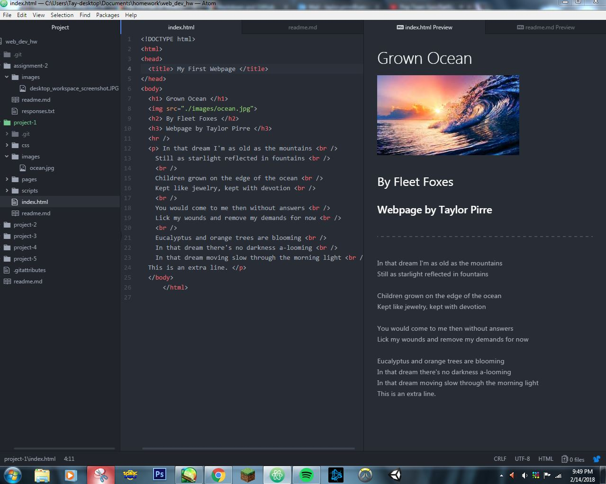

# Taylor Pirre- Project 1 Readme
1. When it comes to Web Browsers, I typically use either Chrome or Firefox. A browser requests connection to a server, the server sends the requested data components of the page back to the browser, and the browser then reads the data that it is sent in order to display the page.
2. During my time in the Internet Wayback Machine, I decided to explore the web archives regarding a popular phenomenon during the late 90s: Beanie Babies. The toy line's official website had archive entires as early as December 1996, with the initial iteration of the site featuring what can only be described as a seizure of colors. Gif loops of dancing beanie babies decorated the site's sidebar- something that I find simultaneously cute and hilarious. In comparison, the present day version of the site is dramatically different, with its use of color being exponentially reined in while still remaining bright and inviting enough to be accessible to the company's young demographic.
3. *Because this is my second time taking this course, I was able to rework some of my old code from last semester into the this semester's iteration of Project-1. I did not run into any problems with my work this time, and I had a fun time exploring archaic web pages again with the Internet Wayback Machine portion of this week's lesson module. It was interesting to see how much web design practices have evolved and changed since the internet's inception.*

